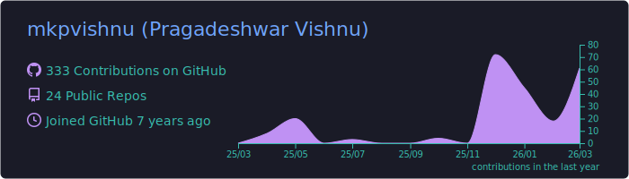
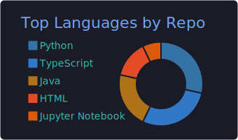
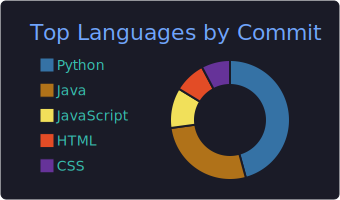
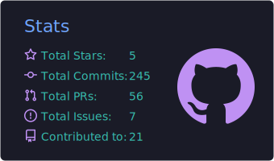
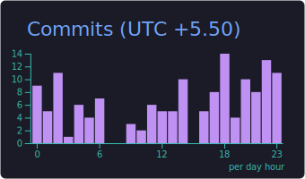

# Hey, I'm Vishnu 👋

**SDET by day, RF nerd by curiosity, chaos engineer by Minecraft.**

I break things professionally (cloud infrastructure, APIs, GPU instances) and occasionally build things that work. Currently obsessed with making test pipelines smarter and exploring how AI can make QA less painful.

---

### 🔧 What I Do

- **Testing & Automation** — Python, pytest, Locust, FastAPI, Jenkins pipelines, performance testing at scale
- **Cloud & Infra** — VM orchestration, GPU compute testing, AWS, OpenSearch/Elasticsearch, PromQL/LogQL
- **AI/ML Testing** — Quality metrics (BLEU, ROUGE, F1), ML pipeline validation, agentic framework testing
- **RF/ML Research** — Digital Predistortion for power amplifiers, 5G/6G signal processing, published papers

---

### 🚀 Current Obsessions

- Building **Pynch** — an AI-native API testing tool with MCP server generation
- Smarter CI/CD with better observability and Slack notifications that don't suck
- Figuring out how to give AI coding assistants enough context without hitting token limits

---

### 📦 Projects @ [yektod](https://github.com/yektod)

| Repo | What it does |
|------|--------------|
| [lingualens](https://github.com/yektod/lingualens) | `<!-- TODO: Add description -->` |
| [pytest-essentials](https://github.com/yektod/pytest-essentials) | `<!-- TODO: Add description -->` |
| [openserverui](https://github.com/yektod/openserverui) | `<!-- TODO: Add description -->` |
| [clawdmicro](https://github.com/yektod/clawdmicro) | `<!-- TODO: Add description -->` |

---

### 🎮 When I'm Not Coding

- Running Minecraft servers with overcomplicated command block contraptions
- Designing parkour courses and arena combat systems nobody asked for
- Traveling for pilgrimages and adding stamps to the passport

---

### 📊 Stats

  

  
  

  
  

---

### 🔗 Find Me

---

  <i>If it works, don't touch it. If it doesn't, write a test first.</i>

